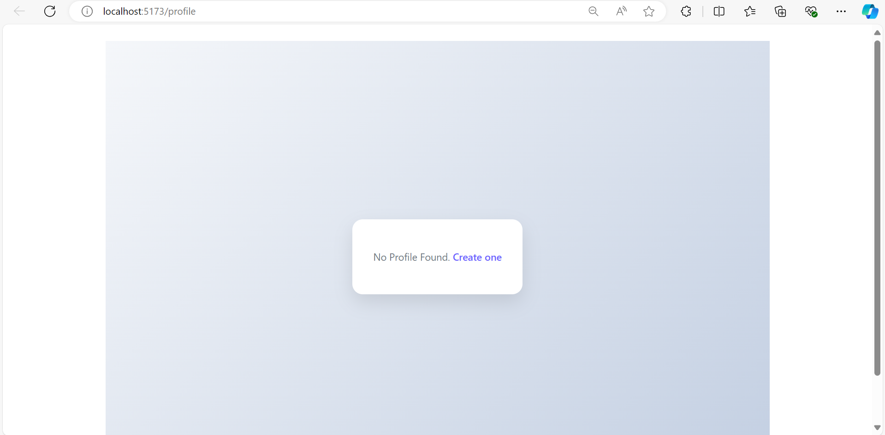
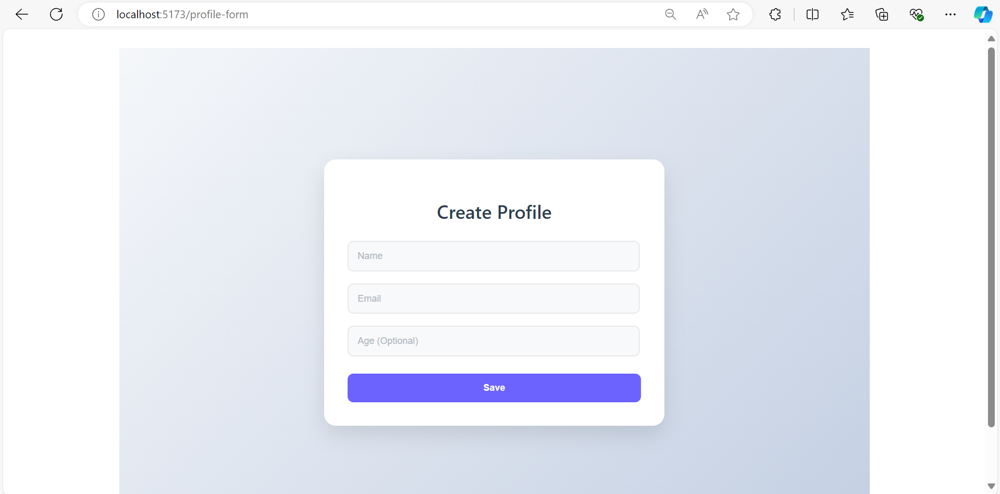
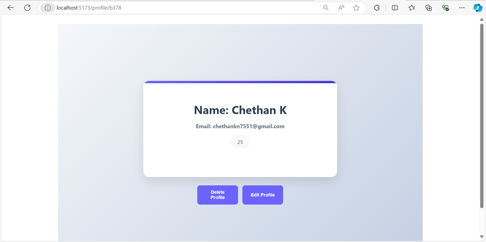
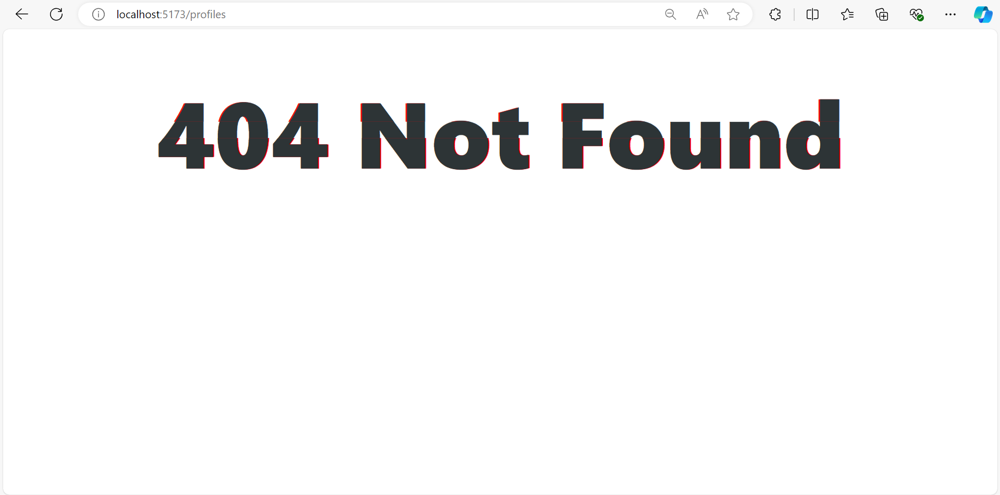

# Profile Management Application

This is a simple profile management application built with React, Typescript and JSON server for mock API calls.
This application allows users to create, view, edit and delete profiles.

## Prerequisites

- Node.js (v14 or heigher)
- npm (Node Package Manager)
- JSON-server (To mock API)
- I used vite to create this react app (`https://v3.vitejs.dev/guide/`)

### Installation

1. **Install dependencies**:
    ```npm install```

3. **Set up environment variables**:

    ```
    # .env file
    VITE_API_BASE_URL_DEV='http://localhost:5000' #Mock Api base url
    VITE_API_BASE_URL_PROD=    # Add production url here in .env file
    VITE_NODE_ENV='development'
    ```

4. **Run JSON server** (for local Mock API):

    In one terminal, start `json-server` to simulate API endpoints.

    ```npm run dev```

    This will host the mock server on  `http://localhost:5000`


### Running the Application

1. **Start the application**:

    In new terminal window, start the development server.

    ```npm start``` or ```npm start:dev```

    To start production server.

    ```npm run start:prod```

2. **Access the Application**:

    Open your browser and navigate to `http://localhost:5173/` to use the application.


### Build and deploy

To create an optimised production build, use:

```npm run build```


Approch and Optimizations

1. Typescript for type safety: Typescript improves code reliability and helps prevent runtime errors by enforcing type checks.
2. Context API: The application uses React's Context API to manage global state for profile data, making the state accessible throughtout the component tree.
3. Environment based API urls: Configured environment-based urls for development and production, allowing easy deployment and testing.

### Website link
    Click here to see the app `https://iridescent-platypus-c6965b.netlify.app`

### ScreenShots for reference




